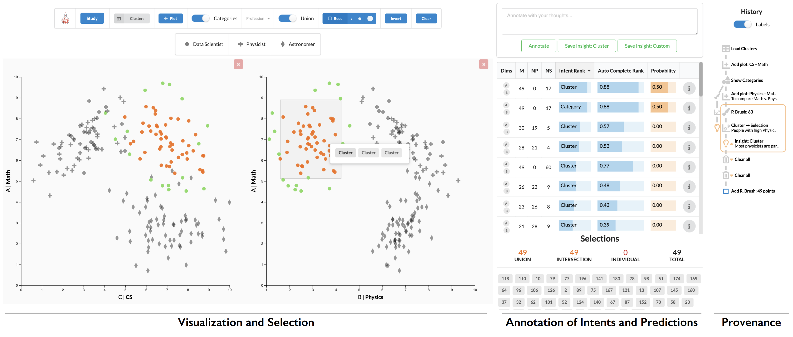

<!-- [](https://travis-ci.com/visdesignlab/intent-system) -->

# Intent System



The system is deployed to: https://vdl.sci.utah.edu/predicting-intent

## Development

To build the server you need `python3`, `pipenv` and `yarn` package manager.

### First time

After cloning the repository for the first time, ensure you have `python3` and `pipenv`, then run:

```shell
yarn run build-env
```

### Starting development server

To start the server run:

```shell
yarn start
```
